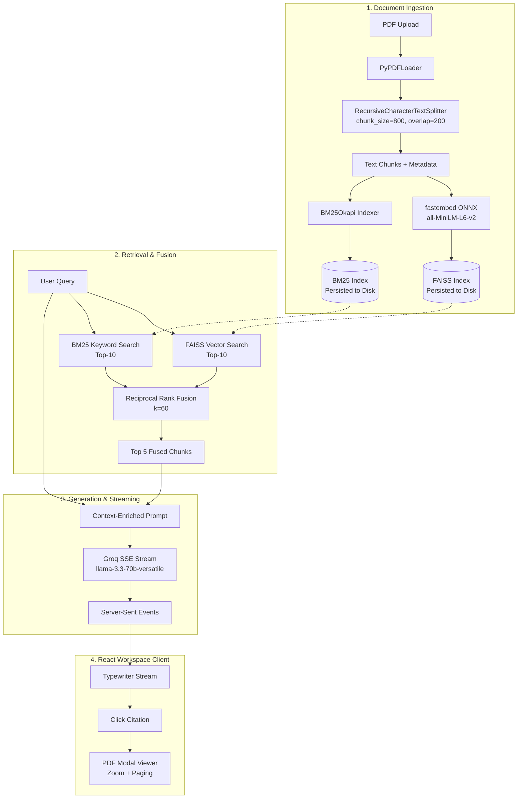

# 📁 Enterprise Document Search & Knowledge Base Workspace

A high-performance, citation-backed **Retrieval-Augmented Generation (RAG)** platform designed for engineering teams and internal documentation hubs. Inspired by the clean, information-dense visual languages of **Notion, Linear, GitHub, and Confluence**, this platform enables teams to index PDFs, run hybrid semantic + keyword searches across deep technical documentation, and extract citation-backed syntheses.

Clicking any citation immediately focuses the integrated **PDF Modal Viewer** exactly on the page where the source evidence was found.

---

## 🚀 Key Capabilities

- **Hybrid Search (RRF)**: Merges dense semantic vectors (**FAISS** via `fastembed`) and sparse keyword matches (**BM25 Okapi**) using **Reciprocal Rank Fusion (RRF)** for optimal retrieval precision.
- **Lightweight ONNX Embeddings**: Uses `fastembed` to run `all-MiniLM-L6-v2` locally via ONNX runtime — no PyTorch required, ~150MB RAM footprint.
- **Real-Time Token Streaming**: Answers stream token-by-token via **Server-Sent Events (SSE)** using Groq's streaming API.
- **Precise Citation Backing**: Every answer is strictly grounded on uploaded documents with page-level citation anchors (`[1]`, `[2]`, `[3]`).
- **Disk Persistence**: FAISS indices, BM25 registries, and chunk metadata persist to `backend/data/indices/` and survive server restarts.
- **Professional Workspace UI**: Clean, tinted neutral palette modelled after Linear, GitHub, and Confluence — no AI chatbot aesthetics.

---

## 🏗️ System Architecture



---

## 🛠️ Tech Stack

### Backend
| Component | Technology |
|---|---|
| Framework | `FastAPI` (Python 3.10+) |
| PDF Loading | `LangChain` — `PyPDFLoader` + `RecursiveCharacterTextSplitter` |
| Embeddings | `fastembed` — ONNX runtime, `all-MiniLM-L6-v2`, no PyTorch |
| Vector Store | `faiss-cpu` — `IndexFlatL2`, persisted to disk |
| Sparse Search | `rank-bm25` — BM25 Okapi, persisted to disk |
| Fusion | Reciprocal Rank Fusion (RRF, k=60) |
| Language Model | `Groq API` — `llama-3.3-70b-versatile`, SSE streaming |

### Frontend
| Component | Technology |
|---|---|
| Framework | `React 19` + `Vite` |
| Styling | Vanilla CSS — Linear/Notion-inspired tinted neutrals |
| HTTP Client | `Axios` with upload progress hooks |
| PDF Rendering | `React-PDF` with web worker support |
| Streaming | Native `EventSource` / SSE |

---

## 📂 Project Structure

```
Production-Rag/
├── backend/
│   ├── app/
│   │   ├── generator.py    # Groq LLM prompts & SSE streaming
│   │   ├── ingest.py       # PDF parsing, chunking, FAISS + BM25 persistence
│   │   ├── main.py         # FastAPI routes (upload, search, documents, delete)
│   │   ├── reranker.py     # RRF score-based sorting (no CrossEncoder)
│   │   └── retrieval.py    # fastembed ONNX embeddings, FAISS + BM25 + RRF
│   ├── data/
│   │   ├── documents/      # Uploaded PDFs served as static files
│   │   └── indices/        # FAISS .index + BM25 .pkl + chunks.json per doc
│   ├── .env                # GROQ_API_KEY
│   ├── Procfile            # Render start command
│   └── requirements.txt    # Minimal Python dependencies
├── frontend/
│   ├── src/
│   │   ├── App.jsx         # Main workspace panel + search console
│   │   ├── App.css         # Layout and card styles
│   │   ├── ChatMessage.jsx # Query / Synthesis timeline entries
│   │   ├── index.css       # CSS variables, color tokens, scrollbars
│   │   ├── PdfModal.jsx    # PDF viewer modal with zoom + paging
│   │   ├── Sidebar.jsx     # File explorer + upload zone
│   │   ├── SourcesPanel.jsx# Extracted evidence reference panel
│   │   └── Typewriter.jsx  # SSE token streaming printer
│   ├── .env                # VITE_API_URL (set to backend URL for prod)
│   └── vite.config.js
└── readme.md
```

---

## ⚙️ Running Locally

### 1. Backend

```powershell
cd backend
python -m venv venv
.\venv\Scripts\Activate.ps1
pip install -r requirements.txt
```

Create `backend/.env`:
```env
GROQ_API_KEY=your_groq_api_key_here
```

Start the server:
```powershell
uvicorn app.main:app --reload
```

API runs at `http://127.0.0.1:8000` — docs at `http://127.0.0.1:8000/docs`.

### 2. Frontend

```powershell
cd frontend
npm install
npm run dev
```

Open `http://localhost:5173`.

For production, set in `frontend/.env`:
```env
VITE_API_URL=https://your-backend.onrender.com
```

---

## 🚀 Production Deployment

### Backend → Hugging Face Spaces (Docker Space)

1. Push repo to GitHub.
2. Go to [Hugging Face Spaces](https://huggingface.co/spaces) and click **Create new Space**.
3. Settings:
   - **Space name:** `your-rag-backend`
   - **License:** `mit` (or your choice)
   - **Select the Space SDK:** `Docker` -> `Blank`
   - **Space hardware:** `Free` (Provides 16GB RAM and 2 vCPUs)
4. Under "Space settings", add your **Repository Secret**: `GROQ_API_KEY`
5. Since your code is on GitHub, you can link it directly or push your code to the Hugging Face git remote. Ensure the `backend` folder contains the `Dockerfile`.
   - **Note:** Because the Space starts from the root, ensure your Dockerfile is placed at the root or configure the Space to build from `backend/Dockerfile`. The provided Dockerfile assumes it's run from the `backend` directory.

*(Alternative: You can simply copy the contents of your `backend` folder into the Hugging Face Space file editor if you don't want to use git).*

### Frontend → Vercel

1. Create a **Project** on [Vercel](https://vercel.com):
   - **Root Directory:** `frontend`
   - **Framework:** `Vite`
   - **Output:** `dist`
2. Add **Environment Variable:** `VITE_API_URL` = your Render backend URL.
3. Deploy.