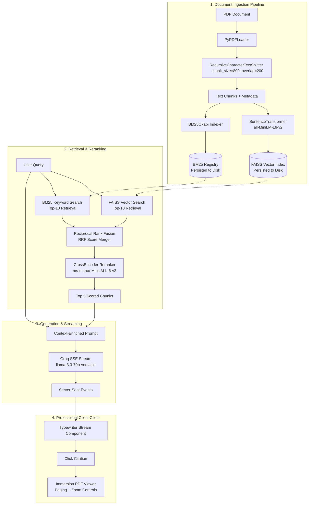

# 📁 Enterprise Document Search & Knowledge Base Workspace

A high-performance, citation-backed **Retrieval-Augmented Generation (RAG)** platform designed for engineering teams and internal documentation hubs. Inspired by the clean, information-dense visual languages of **Notion, Linear, GitHub, and Confluence**, this platform enables teams to index PDFs, search across deep technical documentation, and extract citation-backed syntheses. 

Clicking any extracted citation immediately focuses the integrated high-fidelity **PDF Modal Viewer** exactly on the page from which the source evidence was gathered.

---

## 🚀 Workspace Capabilities

- **Notion & Linear Workspace Design**: Clean light tinted neutrals (`#F3F6FA` canvas background, `#EEF2F7` explorer sidebar, and `#D8E0EA` borders) optimized for developer clarity and structured information density.
- **Complete Emoji-Free Visuals**: All generic emojis have been replaced with modern, natively rendered vector SVG graphics (directory folders, document sheets, upload arrow trays, database structures, and spinner loaders).
- **Dual-Engine Retrieval (RRF Hybrid Search)**: Merges semantic dense vectors (FAISS IndexFlatL2 built with `all-MiniLM-L6-v2` embeddings) and sparse tokenized keywords (**BM25 Okapi**) using **Reciprocal Rank Fusion (RRF)** ($k=60$).
- **Deep Cross-Encoder Reranking**: Leverages `ms-marco-MiniLM-L-6-v2` to compute contextual similarity logits between query and candidate chunks, surfacing the top 5 highly qualified context windows.
- **Real-Time Token Streaming**: Real-time token delivery via Server-Sent Events (SSE) with an automated HTTP REST fallback wrapper.
- **Precise Citation Backing**: Generated syntheses include page-level citation anchors (e.g., `[1]`, `[2]`).
- **Disk Persistence**: Vector indices, BM25 mappings, and chunk registries persist to disk inside `backend/data/indices/` to survive server restarts.

---

## 🏗️ System Architecture

The following diagram illustrates how documents are ingested, indexed, queried, and surfaced back to the user interface:



---

## 🛠️ Tech Stack & Dependencies

### Backend
- **Framework**: `FastAPI` (Python 3.10+) for lightweight, high-speed asynchronous REST and SSE streaming.
- **PDF Loader & Splitting**: `LangChain` (`PyPDFLoader` & `RecursiveCharacterTextSplitter`) to split documents into distinct $800$-character chunks with $200$-character overlaps to preserve context boundaries.
- **Dense Vector Store**: `FAISS` (`faiss-cpu`) for instantaneous multi-dimensional vector math.
- **Embedding Model**: `SentenceTransformers` (`all-MiniLM-L6-v2`) generating 384-dimensional dense semantic vectors.
- **Sparse Search**: `rank-bm25` implementing the BM25 Okapi relevance model.
- **Reranker**: `CrossEncoder` (`cross-encoder/ms-marco-MiniLM-L-6-v2`) to compute deep similarity logits between query and candidate text.
- **Language Model**: `Groq API` (executing the powerful reasoning model `llama-3.3-70b-versatile`).

### Frontend
- **Framework**: `React 19` with `Vite` for sub-millisecond hot module reloading (HMR) and optimized production builds.
- **Styling**: `Tailwind CSS v4` + Vanilla custom stylesheets for Linear-style card metrics:
  ```css
  border-radius: 12px;
  border: 1px solid #D8E0EA;
  box-shadow: 0 1px 2px rgba(0,0,0,0.04);
  ```
- **HTTP Client**: `Axios` with interactive `onUploadProgress` hooks to power the file upload progress bar.
- **Document Rendering**: `React-PDF` (with customized web worker distribution logic) for high-performance vector rendering of standard PDF documents in the browser.

---

## 📂 Project Structure

```
Production-Rag/
├── backend/
│   ├── app/
│   │   ├── __init__.py
│   │   ├── generator.py       # Groq API LLM prompts & async SSE streaming loops
│   │   ├── ingest.py          # PDF parsing, splitting, embedding, and FAISS disk persistence
│   │   ├── main.py            # FastAPI main router, file uploads, delete, and streaming routes
│   │   ├── rag_pipeline.py    # Pipeline orchestrator module
│   │   ├── reranker.py        # SentenceTransformer cross-encoder implementation
│   │   └── retrieval.py       # Dual-engine search with Reciprocal Rank Fusion (RRF)
│   ├── data/
│   │   ├── documents/         # Local backup storage for indexed PDFs
│   │   └── indices/           # FAISS index and BM25 pickles persisted to disk
│   ├── .env                   # Environment secrets (Groq API Key)
│   ├── requirements.txt       # Python environment dependencies
│   └── venv/                  # Python virtual environment
├── frontend/
│   ├── public/                # Static public assets
│   ├── src/
│   │   ├── App.css            # Notion/Linear layouts & responsive card styling
│   │   ├── App.jsx            # Main workspace panel, search consoles, and active headers
│   │   ├── ChatMessage.jsx    # Clean timeline entries (Query vs Synthesis layout)
│   │   ├── index.css          # Core CSS variables, tinted colors, and scrollbar modifications
│   │   ├── main.jsx           # React app renderer
│   │   ├── PdfModal.jsx       # Immersion modal overlay with zoom, paging, and white tools
│   │   ├── PdfViewer.jsx      # Vector rendering canvas wrapper
│   │   ├── SourcesPanel.jsx   # Extracted evidence list panel
│   │   └── Typewriter.jsx     # Typewriter streaming token printer
│   ├── package.json           # Frontend package scripts and versions
│   └── vite.config.js         # Vite configuration settings
└── readme.md                  # System documentation (this file)
```

---

## ⚙️ Installation & Running Locally

### 1. Prerequisites
- **Python**: version `3.10` or newer.
- **Node.js**: version `18` or newer with `npm`.
- **Groq API Key**: Get a free API Key from the [Groq Console](https://console.groq.com/).

---

### 2. Backend Setup

1. **Navigate to the backend directory**:
   ```powershell
   cd backend
   ```

2. **Create and activate a virtual environment**:
   *On Windows:*
   ```powershell
   python -m venv venv
   .\venv\Scripts\Activate.ps1
   ```
   *On macOS/Linux:*
   ```bash
   python3 -m venv venv
   source venv/bin/activate
   ```

3. **Install Dependencies**:
   ```powershell
   pip install -r requirements.txt
   ```

4. **Setup Environment Variables**:
   Create a `.env` file in the `backend/` directory and add your Groq API Key:
   ```env
   GROQ_API_KEY=your_actual_groq_api_key_here
   ```

5. **Start the FastAPI server**:
   ```powershell
   uvicorn app.main:app --reload
   ```
   The API server will launch at `http://127.0.0.1:8000`. You can explore the OpenAPI interactive docs at `http://127.0.0.1:8000/docs`.

---

### 3. Frontend Setup

1. **Navigate to the frontend directory**:
   ```powershell
   cd ../frontend
   ```

2. **Install Node modules**:
   ```powershell
   npm install
   ```

3. **Launch the development server**:
   ```powershell
   npm run dev
   ```
   Navigate to `http://localhost:5173` to explore the workspace console.